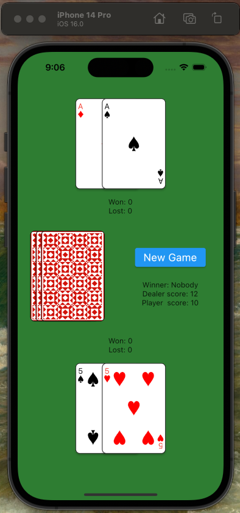
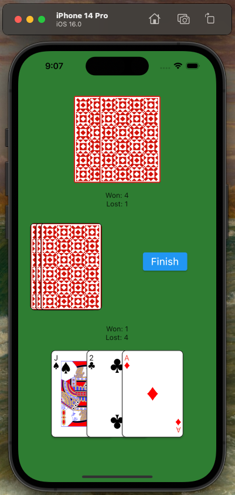

# Blackjack Game as Flutter Package
This is a simple and fun blackjack game developed in Flutter. The game follows the classic rules of blackjack, where the goal is to beat the dealer by having a hand value of 21 or as close as possible to 21.

Home            |  In Game
:-------------------------:|:-------------------------:
  |  

## Features
- Chip betting system
- Fancy card rotation animation

## How to Play
1. Start the game by tapping the "New Game" button.
2. The game will deal two cards to you and two cards to the dealer.
3. You can choose to hit (get another card) "Click on Deck", stand (keep your hand as is) "Finish" button.
4. The dealer will then play their hand according to the rules of the game.
5. If your hand value is higher than the dealer's hand value, you win the game.
6. If the dealer's hand value is higher, you lose the game.

## Requirements
Flutter 1.17.0 or higher
Dart 2.9 or higher

# Getting Started
Clone the repository by running the following command:
```bash
git clone https://github.com/marcello-a/Flutter_Blackjack
```

Change into the repository directory:
```
cd Flutter_Blackjack/example
```
Run the following command to install the dependencies:
```
flutter pub get
```
Run the following command to run the app:
```
flutter run
```
Contributing
If you want to contribute to the project, please open a pull request. Your contributions are always welcome!
